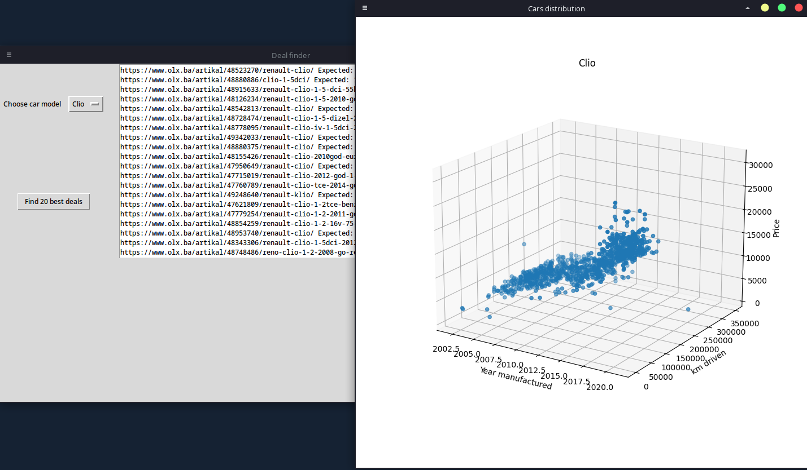

# About
## What
Analysis of cars listed to be sold in Bosnia and Herzegovina from April 2022 until 31 Dec 2023. Roughly 270 000 cars.
Each listing is only scraped once, no matter if it is only published once, or renewed multiple times.
I have also included a sample of 50 000 cars.

There is also colab notebook available here https://colab.research.google.com/drive/1_OxzlcW9bObyXPmEckXRpM1UhO6Q6CaA?usp=sharing

## Why
We wanted to buy a car but the prices were going wild in the middle of the pandemic. So while searching for the car I started scraping them and making some stuff: like a script that sends message to my phone when a car with given specs is found and an app that finds 20 best listings using linear regression (it's really bad). 

After we bought one I was left with so much data, I started analyzing it and slowly adding more stuff.